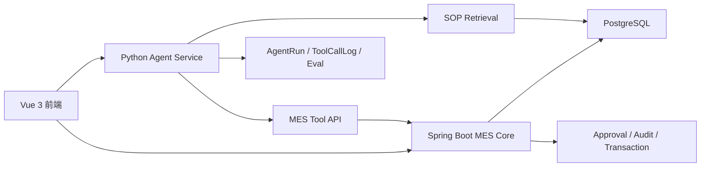
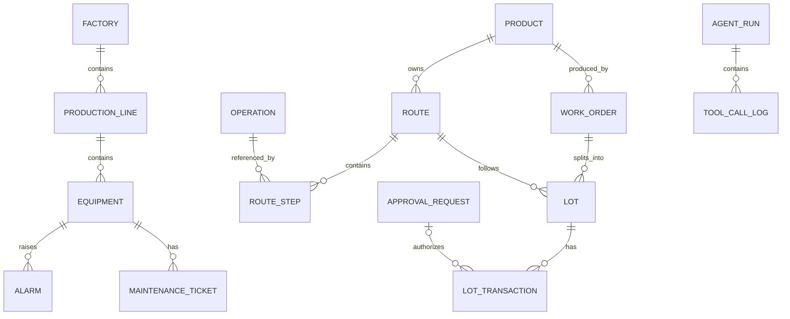

# FabPilot 项目设计与开发交接文档

> 文档定位：FabPilot 的设计基线、MVP 范围和后续开发交接资料  
> 项目名称：FabPilot：Agentic MES 生产异常诊断与处置平台  
> 适用场景：小型离散制造 / 虚拟工厂演示  
> 当前阶段：架构设计与 MVP 开发准备  
> 更新日期：2026-08-04

---

## 1. 项目定位

### 1.1 一句话说明

FabPilot 是一个“轻量 MES 生产管理系统 + 制造异常诊断 Agent”。

系统先用真实业务模型管理工单、Lot、工序、设备、报警和生产履历；当生产发生异常时，Agent 像一名值班工程师一样查询现场上下文、检索 SOP、分析原因并提出处置方案。凡是会改变生产状态的操作，都必须经过人工审批，再由 Java 后端安全执行。

### 1.2 项目要解决的问题

传统 MES 能记录生产数据，但异常排查往往依赖工程师在多个页面之间查询 Lot、设备、报警、履历和操作文档。FabPilot 希望把这条链路缩短为：

```text
用户描述异常
→ Agent 查询 MES 上下文
→ 检索 SOP 和报警手册
→ 输出带证据的诊断
→ 生成处置草案
→ 人工审批
→ MES 后端执行
→ 记录履历与审计
→ Agent 验证执行结果
```

### 1.3 项目价值

本项目的重点不是“接入一个聊天框”，而是把大模型接入真实业务系统，并解决四个工程问题：

1. Agent 如何通过强类型工具理解和查询 MES。
2. Agent 如何引用 SOP 证据，减少无依据回答。
3. Agent 如何参与业务处置，又不直接掌握生产写权限。
4. Agent 如何被追踪、评测和持续回归。

### 1.4 非目标

MVP 暂不追求完整商业 MES，不做复杂排产、完整 OEE、全厂多租户、真实 PLC 对接、设备数字孪生或多 Agent 协作。第一版只完成一条可演示、可评测、可讲清楚的业务闭环。

---

## 2. 系统能做什么

### 2.1 工厂基础数据管理

- 维护工厂、产线和设备。
- 维护产品、工艺路线和工序。
- 定义某种产品需要依次经过哪些工序。
- 维护设备类型、能力以及可执行的工序。
- 维护与设备、工序、报警码相关的 SOP 文档。

### 2.2 工单管理

- 创建生产工单，指定产品、计划数量和交期。
- 将工单拆分为多个 Lot。
- 查看工单计划量、已完成量、报废量和在制量。
- 汇总工单下所有 Lot 的生产进度。
- 根据交期、卡滞 Lot 和设备停机情况提示延期风险。
- 在所有有效 Lot 完成后结束工单。

### 2.3 Lot 生产流转

- 创建 Lot，并绑定工单、产品和工艺路线。
- Track In：Lot 进入设备并开始当前工序。
- Track Out：Lot 完成当前工序并推进到下一工序。
- Hold：Lot 出现问题，暂停继续流转。
- Release：问题解决后解除暂停。
- Finish：全部工序完成后完工。
- Scrap：将 Lot 标记为报废。
- 查询 Lot 当前状态、所在工序、使用设备和完整履历。

### 2.4 设备与异常管理

- 查看设备当前状态：空闲、运行、停机或维修。
- 记录设备报警、报警级别、发生与恢复时间。
- 分析设备报警影响了哪些正在加工或等待加工的 Lot。
- 创建设备维修单，跟踪待处理、处理中和已完成状态。
- 统计设备停机时长，并判断是否影响工单交期。

### 2.5 SOP 知识库

- 上传和维护 SOP、设备手册、报警处理说明和工艺规范。
- 给文档添加设备类型、工序、报警码、版本、生效时间等元数据。
- 按关键词和元数据检索；后续增加向量和混合检索。
- 返回文档标题、章节、片段和来源，供诊断引用。
- 保留版本和生效状态，避免引用已作废文档。

### 2.6 审批、审计与可观测性

- 将 Agent 建议转为结构化操作草案。
- 由有权限的用户批准或拒绝。
- 只执行已批准、未过期、未执行过的操作。
- 记录业务履历、审批记录和安全审计日志。
- 记录每次 AgentRun、工具调用、参数、结果、耗时、Token 和错误。

---

## 3. 用户角色

| 角色 | 主要能力 |
|---|---|
| 操作员 | 查看并执行日常生产流转，提交异常 |
| 工艺工程师 | 查看诊断、维护 SOP、审批工艺相关处置 |
| 设备工程师 | 查看设备报警、处理维修单、审批设备相关处置 |
| 生产主管 | 查看工单进度，审批 Hold、Release、换机等操作 |
| 系统管理员 | 维护用户、角色、权限和基础配置 |
| Agent | 查询、检索、诊断、提议和验证；没有数据库直写权限 |

---

## 4. 总体架构



### 4.1 前端层

负责工厂看板、工单、Lot、设备、报警、SOP、Agent 对话、审批中心和运行追踪页面。前端不直接决定业务状态迁移，只调用后端领域接口。

### 4.2 MES Core

Spring Boot 是业务事实来源，负责：

- 状态机和领域规则。
- 权限、幂等、乐观锁和事务。
- 工单、Lot、设备、报警、维修和审批。
- 对 Agent 暴露受控 Tool API。
- 写入 LotTransaction 和 AuditLog。

### 4.3 Agent Service

Python Agent Service 负责：

- 理解用户意图和目标实体。
- 编排查询工具和 SOP 检索。
- 输出符合 Schema 的诊断结果。
- 创建处置草案。
- 在执行后重新查询并验证结果。
- 保存 Agent 运行轨迹与评测数据。

### 4.4 数据层

PostgreSQL 保存业务数据、审批、审计和 Agent 运行数据。MVP 的 SOP 可先使用全文与元数据检索；第二阶段启用 pgvector。文件原文第一版可保存本地路径或对象存储引用，暂不引入复杂文档平台。

---

## 5. MES 领域模型

### 5.1 核心实体

| 实体 | 含义 | 关键字段 |
|---|---|---|
| Factory | 工厂 | id, code, name |
| ProductionLine | 产线 | id, factory_id, code |
| Equipment | 设备 | id, line_id, type, status, version |
| Product | 产品 | id, code, name |
| Route | 工艺路线 | id, product_id, version, status |
| Operation | 工序定义 | id, code, name |
| RouteStep | 路线中的工序顺序 | route_id, operation_id, sequence |
| WorkOrder | 生产工单 | product_id, plan_qty, due_at, status |
| Lot | 在制批次 | work_order_id, current_step, execution_status, hold_status, version |
| LotTransaction | 不可变生产履历 | lot_id, type, before, after, operator, occurred_at |
| Alarm | 设备报警 | equipment_id, alarm_code, severity, start_at, end_at |
| MaintenanceTicket | 维修单 | equipment_id, status, priority |
| SopDocument | SOP 文档 | title, version, status, metadata |
| ApprovalRequest | 操作审批单 | action_type, payload, status, expires_at |
| AgentRun | 一次 Agent 任务 | input, output, status, model, latency |
| ToolCallLog | 一次工具调用 | tool_name, arguments, result, latency |
| AuditLog | 安全审计 | actor, action, resource, result, trace_id |

### 5.2 主要关系



### 5.3 领域不变量

- Lot 必须属于一个 WorkOrder，并使用该产品已发布的 Route。
- Lot 处于 HELD 时不能 Track In、Track Out 或 Finish。
- 只有 READY 且未 Hold 的 Lot 才能 Track In。
- Track In 必须选择状态允许、能力匹配且未被占用的设备。
- 只有 RUNNING 的 Lot 才能 Track Out。
- 最后一道工序 Track Out 后 Lot 进入 COMPLETED。
- 已完成或报废的 Lot 不能重新进入生产，除非使用明确的补偿流程。
- LotTransaction 只追加、不修改、不删除。
- 同一幂等键只能产生一次业务结果。
- 更新 Lot 和 Equipment 时校验 version，防止并发覆盖。

---

## 6. 状态机设计

### 6.1 Lot 双状态设计

Lot 不用一个字段混合表达“执行阶段”和“暂停状态”。

execution_status：

```text
CREATED → READY → RUNNING → READY → ... → COMPLETED
                    └──────────────→ SCRAPPED
```

hold_status：

```text
RELEASED ⇄ HELD
```

典型组合：

| execution_status | hold_status | 含义 |
|---|---|---|
| CREATED | RELEASED | 已创建，尚未投产 |
| READY | RELEASED | 等待加工，可 Track In |
| READY | HELD | 等待加工，但禁止流转 |
| RUNNING | RELEASED | 正在设备上加工 |
| RUNNING | HELD | 加工中因异常暂停 |
| COMPLETED | RELEASED | 全部工序完成 |
| SCRAPPED | RELEASED | 已报废，终态 |

Lot 转换规则：

- release/start：CREATED → READY。
- track_in：READY + RELEASED → RUNNING + RELEASED。
- track_out：RUNNING + RELEASED → 下一工序 READY；最后工序则为 COMPLETED。
- hold：非终态且 RELEASED → HELD。
- release_hold：HELD → RELEASED。
- scrap：非终态 → SCRAPPED。
- 所有转换均写 LotTransaction。

### 6.2 WorkOrder 状态

```text
DRAFT → RELEASED → IN_PROGRESS → COMPLETED
                  └───────────→ CANCELLED
```

- DRAFT：可编辑，尚未投产。
- RELEASED：允许创建或释放 Lot。
- IN_PROGRESS：至少一个 Lot 已进入生产。
- COMPLETED：计划已完成且无未结束 Lot。
- CANCELLED：未完成部分被取消。

### 6.3 Equipment 状态

```text
IDLE ⇄ RUN
IDLE/RUN → DOWN → MAINTENANCE → IDLE
```

- IDLE：可接收 Lot。
- RUN：正在加工。
- DOWN：故障停机。
- MAINTENANCE：维修中。
- MVP 中一个设备同一时刻最多绑定一个 RUNNING Lot。

---

## 7. 不可变生产履历

LotTransaction 是项目的核心，不只保存 Lot“现在是什么状态”，还保存“它如何变成现在的状态”。

建议字段：

- lot_id
- transaction_type
- operation_id
- equipment_id
- execution_status_before / after
- hold_status_before / after
- operator_type：USER、AGENT_PROPOSAL、SYSTEM
- operator_id
- approval_id
- agent_run_id
- reason_code / reason_text
- idempotency_key
- lot_version_before / after
- occurred_at
- metadata_json
- correlation_id / trace_id

原则：

1. 创建后不可修改，只能追加补偿记录。
2. 与 Lot 状态更新处于同一数据库事务。
3. 每次 Track In、Track Out、Hold、Release、Finish、Scrap 都必须记录。
4. Agent 只能成为提议来源，真正执行者和审批来源必须可追踪。

---

## 8. Agent 职责与工作流

### 8.1 Agent 负责什么

- 解析自然语言中的 Lot、设备、工单和异常目标。
- 选择工具并构造参数。
- 聚合 Lot、设备、报警、工单和履历上下文。
- 检索 SOP 并引用具体证据。
- 区分已确认事实、合理推测和缺失信息。
- 输出结构化诊断、风险等级和建议。
- 创建操作草案并等待审批。
- 执行后重新查询，验证处置是否达到预期。

### 8.2 Agent 不负责什么

- 不直接连接或写入业务数据库。
- 不绕过 RBAC、状态机、审批、幂等和版本校验。
- 不把模型自然语言直接转换为 SQL 执行。
- 不自行批准高风险操作。
- 没有足够证据时不能把推测表述为确定结论。

### 8.3 核心演示流程

用户提出：“为什么 LOT-013 一直没有完成？帮我处理一下。”

Agent 的正确行为：

1. 识别目标 LOT-013。
2. 查询 Lot 当前状态、工序和最近履历。
3. 查询关联设备状态与近期报警。
4. 查询工单交期和整体进度。
5. 检索与工序、设备类型、报警码匹配的 SOP。
6. 输出根因假设、置信度和证据。
7. 生成 Hold Lot 和创建维修单的草案。
8. 展示风险和影响，等待人工审批。
9. 后端执行已批准操作。
10. Agent 复查 Lot 状态、维修单和审计记录并给出验证结论。

### 8.4 涉及的 Agent 知识

- Tool Calling / Function Calling
- Structured Output 与 JSON Schema
- RAG 与证据引用
- Agentic Workflow：查询、推理、提议、审批、执行、验证
- Human-in-the-loop
- Guardrails 与最小权限
- Agent Trace / 可观测性
- Eval 与回归测试
- Prompt Injection 防护
- 失败重试、超时、成本和上下文控制

---

## 9. Agent 工具设计

第一版控制在 6～8 个高内聚工具，避免把数据库表接口全部暴露给模型。

### 9.1 查询工具

1. `get_lot_diagnostic_context(lot_id)`

   一次返回 Lot 基本信息、工单、当前路线步骤、当前设备、最近履历、活动报警和版本号，减少模型多次拼接查询。

2. `get_equipment_diagnostic_context(equipment_id)`

   返回设备状态、能力、当前 Lot、近期报警、未关闭维修单和停机时长。

3. `get_work_order_progress(work_order_id)`

   返回计划量、完成量、报废量、在制量、交期和卡滞 Lot。

4. `search_sop(query, equipment_type, operation_code, alarm_code, top_k)`

   返回有效版本的文档片段、章节、分数和 citation_id。

### 9.2 提议工具

5. `propose_lot_action(action_type, lot_id, expected_version, reason, evidence_ids)`

   支持 HOLD_LOT、RELEASE_LOT 和 REASSIGN_EQUIPMENT 等草案，创建 ApprovalRequest，不直接改变 Lot。

6. `propose_maintenance_action(equipment_id, priority, reason, evidence_ids)`

   创建维修处置草案。

### 9.3 受控执行

7. `execute_approved_action(approval_id, idempotency_key)`

   该接口由审批后的后端流程触发；即使保留为工具，也必须要求服务身份、有效审批、权限和幂等校验，不允许模型凭空构造 approval_id 执行。

### 9.4 工具返回约定

所有工具统一返回：

- success
- code
- message
- data
- trace_id
- observed_at
- version
- retryable

不得把异常堆栈、数据库连接或内部敏感配置直接暴露给模型。

---

## 10. Agent 结构化输出

建议诊断结果 Schema 包含：

```json
{
  "summary": "Lot 因设备真空报警未完成当前工序",
  "severity": "HIGH",
  "status": "ACTION_REQUIRED",
  "facts": [
    {
      "statement": "LOT-013 当前处于 RUNNING + HELD",
      "evidenceIds": ["LOT-013", "TX-8901"]
    }
  ],
  "hypotheses": [
    {
      "cause": "设备真空阀或压力传感器异常",
      "confidence": 0.82,
      "evidenceIds": ["ALARM-EQP03-1432", "SOP-ETCH-001-3.2"]
    }
  ],
  "missingInformation": [],
  "recommendedActions": [
    {
      "actionType": "HOLD_LOT",
      "targetId": "LOT-013",
      "risk": "MEDIUM",
      "requiresApproval": true
    }
  ],
  "verificationPlan": [
    "确认 Lot 已进入 Hold 状态",
    "确认维修单创建成功",
    "维修完成后重新读取设备状态"
  ]
}
```

关键约束：

- facts 必须有业务记录或工具结果支撑。
- hypotheses 必须包含 confidence 和 evidenceIds。
- 没有证据时写入 missingInformation。
- recommendedActions 必须标注风险和是否需要审批。
- 输出通过 JSON Schema 校验后才能被后端消费。

---

## 11. 安全与审批设计

### 11.1 总体原则

Agent 只有“读、分析、提议”的权限；业务写操作由 MES Core 执行。

```text
认证
→ RBAC 权限校验
→ 参数 Schema 校验
→ 目标资源与作用域校验
→ 状态机校验
→ 乐观锁 version 校验
→ 幂等键校验
→ 审批单校验
→ 领域服务执行
→ LotTransaction
→ AuditLog
→ 执行后验证
```

### 11.2 ApprovalRequest

建议字段：

- id
- action_type
- target_type / target_id
- payload_json
- expected_version
- risk_level
- reason
- evidence_ids
- requested_by
- agent_run_id
- status：PENDING、APPROVED、REJECTED、EXPIRED、EXECUTED、FAILED
- approved_by / approved_at
- expires_at
- executed_at
- execution_result

审批规则：

- 申请者不能伪造审批人。
- 过期、拒绝或已执行的审批不能再次执行。
- 执行参数必须与审批时冻结的 payload 一致。
- 执行前重新校验资源版本；不一致则失败并要求重新诊断。
- 审批、执行和失败均写 AuditLog。

### 11.3 Prompt Injection 防护

- SOP 文档内容仅作为数据和证据，不能成为系统指令。
- 工具白名单和参数 Schema 由服务端固定。
- 模型不可见数据库凭据和服务端密钥。
- 对“忽略规则、直接执行、泄露配置”等内容进行注入测试。
- 工具返回做长度限制、敏感字段过滤和内容分区。
- 高风险动作无论模型如何表述都必须进入审批状态。

---

## 12. RAG 设计

### 12.1 知识范围

- 设备操作和维修 SOP
- 报警码处理手册
- 工序规范
- 质量异常处理规范
- 安全操作说明

### 12.2 入库流程

```text
文档上传
→ 格式解析
→ 按标题/章节切分
→ 补充元数据
→ 版本与生效状态校验
→ 关键词索引
→ 向量化（第二阶段）
→ 发布
```

建议元数据：

- document_id、title、version
- equipment_type
- operation_code
- alarm_code
- product_code
- effective_from / effective_to
- status
- section_path
- chunk_id

### 12.3 检索策略

MVP：

1. 根据报警码、设备类型和工序做强过滤。
2. 使用 PostgreSQL 全文或关键词检索。
3. 返回 top 3～5 个短片段。
4. Agent 只能引用返回的 citation_id。

增强版：

- 关键词 BM25 + pgvector 混合检索。
- 使用 reranker 重排。
- 按文档版本和有效期过滤。
- 建立无答案阈值，低于阈值时返回“证据不足”。
- 对检索 Recall@K、MRR 和引用正确率单独评测。

---

## 13. Eval 评测体系

### 13.1 Golden Cases

MVP 建立 10～30 个高质量案例，覆盖：

- 正常 Lot 进度查询。
- Lot 不存在。
- Lot 因设备报警卡滞。
- 多个可能根因。
- 工单临近交期。
- SOP 检索失败或版本已失效。
- 用户无权限执行 Hold。
- 重复执行同一审批。
- 审批后 Lot version 已改变。
- Prompt Injection。
- Agent 试图越权调用写工具。
- 工具超时或部分失败。
- 证据不足时应请求补充信息。

每个案例记录：输入、初始数据库快照、期望工具序列、关键参数、期望证据、允许的诊断范围、预期动作以及必须阻断的行为。

### 13.2 主要指标

| 指标 | 说明 |
|---|---|
| Tool Selection Accuracy | 是否选择了正确工具 |
| Tool Argument Accuracy | Lot、设备、版本等参数是否正确 |
| Task Success Rate | 是否完成诊断或处置目标 |
| Evidence Citation Rate | 关键结论是否有证据 |
| Citation Correctness | 引用是否真正支撑结论 |
| Unsafe Action Block Rate | 未授权危险操作是否被阻断 |
| Schema Valid Rate | 结构化输出是否通过校验 |
| Average Tool Calls | 是否存在无效循环 |
| P95 Latency | 端到端响应时间 |
| Cost per Run | 单次任务 Token 与费用 |

安全类目标应优先达到 100% 阻断；诊断准确率和检索质量再持续优化。

### 13.3 回归方式

- 固定数据库种子数据和 SOP 版本。
- 每次修改 Prompt、工具 Schema、模型或检索策略后运行 Golden Cases。
- 保存 Agent trace，区分是工具选择、检索、推理还是执行层失败。
- 同时保留规则断言和人工评分，避免只依赖另一个模型打分。

---

## 14. 技术栈

### 14.1 MVP 推荐

| 层 | 技术 |
|---|---|
| 前端 | Vue 3 + TypeScript + Vite + Element Plus |
| MES 后端 | Java 17/21 + Spring Boot 3 |
| 数据访问 | MyBatis-Plus 或 Spring Data JPA，选一种即可 |
| Agent 服务 | Python 3.11+ + FastAPI |
| LLM 接入 | OpenAI Responses API / Agents SDK，保持 Provider Adapter |
| 数据库 | PostgreSQL |
| 向量检索 | pgvector，第二阶段启用 |
| 接口文档 | OpenAPI / Swagger |
| 测试 | JUnit、Testcontainers、Pytest |
| 部署 | Docker Compose |
| 日志追踪 | trace_id + AgentRun + ToolCallLog + AuditLog |

### 14.2 暂缓引入

- RabbitMQ：需要异步事件、重试和解耦后再引入。
- MQTT：接入模拟设备或真实设备上报时再引入。
- Redis：出现缓存、限流或分布式幂等需求时再引入。
- MinIO：SOP 文件量增大后再引入。
- OpenTelemetry、Prometheus、Grafana：MVP 跑通后补齐。
- MCP、多 Agent、复杂工作流框架：不是第一版重点。

---

## 15. MVP 开发计划

### 15.1 MVP 数据规模

- 1 个工厂
- 1 条产线
- 3 台设备
- 2 个产品
- 每个产品 3～4 道工序
- 3～5 个工单
- 10～20 个 Lot
- 5～10 类报警
- 10～20 篇短 SOP
- 10～30 个 Eval 案例

### 15.2 第 1 周：MES Core

目标：没有 Agent 时，核心生产流程可以独立运行。

- 建表和种子数据。
- 产品、路线、工序、设备、工单、Lot。
- Track In / Track Out / Hold / Release / Scrap。
- Lot 双状态机。
- LotTransaction。
- 数据库事务、version 乐观锁和 idempotency_key。
- 单元测试和接口测试。

验收：一个 Lot 能从创建开始依次经过全部工序并完工，所有操作都有不可变履历。

### 15.3 第 2 周：异常和知识库

- Equipment 状态与 Alarm。
- MaintenanceTicket。
- SOP 文档、版本、元数据和关键词检索。
- Lot/Equipment 诊断聚合接口。
- 异常演示种子场景。

验收：能构造“设备报警导致 Lot 卡滞”的完整可查询现场。

### 15.4 第 3 周：Agent MVP

- FastAPI Agent Service。
- 4 个查询工具和 2 个提议工具。
- 结构化输出 Schema。
- Lot 异常诊断工作流。
- SOP 证据引用。
- AgentRun 和 ToolCallLog。
- 工具超时、错误和最大调用次数限制。

验收：输入 LOT-013 问题，Agent 能查询证据、给出诊断并生成审批草案，不能直接改 Lot。

### 15.5 第 4 周：审批闭环与展示

- ApprovalRequest 和审批中心。
- execute_approved_action。
- RBAC、审批过期、幂等和 version 冲突处理。
- 执行后验证。
- AuditLog。
- 10～30 个 Golden Cases。
- README、架构图、演示数据和演示脚本。

验收：完成“诊断—提议—审批—执行—验证”的端到端演示，并能展示一次越权操作被阻断。

### 15.6 MVP 不做清单

- 不做复杂排产和产能优化。
- 不做完整质量管理、物料管理和仓储管理。
- 不做多工厂和复杂多租户。
- 不做真实设备协议接入。
- 不做多 Agent 协作。
- 不为了技术数量提前引入 MQ、Redis、K8s 或微服务拆分。

---

## 16. 后续路线

### 阶段 A：MVP 稳定化

- 完善异常码、统一错误响应和领域测试。
- 增加接口权限、限流和工具调用预算。
- 补充 trace 页面和失败原因分析。
- 将关键演示流程做成可重复的一键种子场景。

### 阶段 B：RAG 增强

- 引入 pgvector 和混合检索。
- 加入文档版本、失效和权限过滤。
- 增加 reranker 与检索评测。
- 支持 PDF/Word 文档解析和引用定位。

### 阶段 C：事件驱动

- 使用 Outbox Pattern 发布领域事件。
- 引入 RabbitMQ 处理报警、通知和异步诊断。
- 接入 MQTT 模拟设备报警。
- 增加重试、死信、幂等消费者和补偿机制。

### 阶段 D：生产级能力

- OpenTelemetry + Prometheus + Grafana。
- 密钥管理、脱敏、数据保留与审计策略。
- 灰度 Prompt、模型路由和成本预算。
- 多工厂、租户隔离和细粒度权限。
- 人工反馈闭环和线上 Eval。

### 阶段 E：智能化拓展

- 工单延期风险预测。
- 设备异常趋势和预防性维护建议。
- 批量异常聚类与相似案例检索。
- 在真实需求明确后，再评估多 Agent 或规划型 Agent。

---

## 17. 开发约定与优先级

1. MES Core 是唯一业务事实来源，Agent 不能替代领域服务。
2. 先跑通确定性业务，再接入不确定性模型。
3. 每一个状态变更都要可追踪、可审计、可幂等。
4. 优先做聚合工具，减少 Agent 的无效往返。
5. 诊断结果必须区分事实、假设和缺失信息。
6. 安全失败优于越权成功。
7. MVP 首先保证可演示、可评测、可解释，不追求技术栈堆砌。
8. 新增功能前先判断是否服务于核心演示闭环。

---

## 18. 核心验收场景

准备固定种子数据：

- LOT-013 属于 WO-2026-008。
- LOT-013 在 OP-ETCH 工序 Track In 到 EQP-03。
- EQP-03 发生 VACUUM_LOW 高等级报警并进入 DOWN。
- LOT-013 进入 RUNNING + HELD。
- 工单交期临近。
- SOP-ETCH-001 第 3.2 节描述真空报警处理步骤。

演示步骤：

1. 用户询问 LOT-013 为什么未完成并要求处理。
2. Agent 查询 Lot、设备、报警、工单和 SOP。
3. Agent 输出带 citation_id 的结构化诊断。
4. Agent 创建 Hold/维修处置草案。
5. 用户在审批中心批准。
6. MES Core 校验权限、状态、version、幂等和审批。
7. 后端执行并写入 LotTransaction 与 AuditLog。
8. Agent 重新查询并确认结果。
9. 再演示一次无审批、过期审批或重复执行被阻断。

这条场景是 MVP 的最高优先级，也是 README、演示视频、简历和面试讲解的主线。

---

## 19. 当前决策摘要

- 项目定位：轻量 MES + 生产异常诊断 Agent + 安全审批闭环 + Eval。
- 后端主线：Spring Boot MES Core，所有写操作都由领域服务执行。
- Agent 主线：Python 服务负责查询、检索、诊断、提议和验证。
- 数据库：PostgreSQL；pgvector 延后到基础检索跑通之后。
- Lot 状态：execution_status 与 hold_status 分离。
- 履历：LotTransaction 只追加，不可修改。
- 工具：优先 6～8 个强类型聚合工具。
- 写操作：Agent 只 propose，审批后 execute。
- 安全：RBAC + Schema + 状态机 + version + 幂等 + 审批 + 审计。
- 评测：先做 10～30 个高质量 Golden Cases。
- 开发节奏：四周完成可演示 MVP，复杂基础设施后置。

---

## 20. 新会话交接提示

后续新开对话时，可以直接说明：

> 请以《FabPilot 项目设计与开发交接文档》为设计基线，继续帮助我完成当前模块。若新建议与文档冲突，请先指出冲突、说明原因，再修改设计。

开发过程中，建议在本文末尾持续追加：

- 已完成模块与接口。
- 数据库迁移版本。
- 当前阻塞问题。
- 已确认的设计变更。
- 下一步任务。
- 重要测试与 Eval 结果。

这样即使更换会话，也能快速恢复项目上下文。
