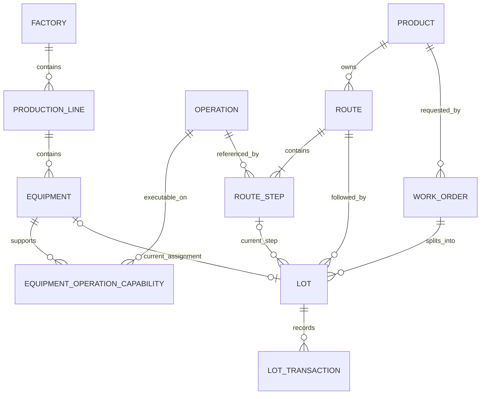

# FabPilot MES Core 初始表设计

## 范围

V1 创建 `product`。V2 创建工厂、工艺、设备、工单、Lot 与履历相关的 10 张表。报警、维修、SOP、审批、审计和 Agent 运行表留到后续迁移。

## 表与职责

| 表 | 职责 | 核心字段 |
|---|---|---|
| `product` | 产品主数据 | `code`, `name`, `version` |
| `factory` | 工厂主数据 | `code`, `name`, `version` |
| `production_line` | 工厂内的产线 | `factory_id`, `code`, `name` |
| `operation` | 可复用的工序定义 | `code`, `name`, `standard_cycle_seconds` |
| `equipment` | 产线设备及当前状态 | `production_line_id`, `code`, `equipment_type`, `status`, `version` |
| `equipment_operation_capability` | 设备与可执行工序的多对多关系 | `equipment_id`, `operation_id` |
| `route` | 产品工艺路线的一个版本 | `product_id`, `code`, `revision`, `status`, `effective_from/to` |
| `route_step` | 路线中的有序工序 | `route_id`, `operation_id`, `sequence_no` |
| `work_order` | 产品生产计划 | `code`, `product_id`, `plan_quantity`, `due_at`, `status`, `version` |
| `lot` | 批次当前业务快照 | `work_order_id`, `route_id`, `current_route_step_id`, `current_equipment_id`, `execution_status`, `hold_status`, `version` |
| `lot_transaction` | Lot 的不可变操作履历 | `lot_id`, `transaction_type`, 状态前后值、操作者、幂等键、版本前后值、发生时间 |

## 关系

## 设计原则

1. `lot` 保存高频查询需要的当前状态，`lot_transaction` 保存状态如何变化；状态更新与履历追加必须在同一事务中完成。
2. 执行状态和 Hold 状态分开，避免一个状态字段组合出大量难以维护的枚举值。
3. 工序定义与路线步骤分开，同一个工序可被多条产品路线复用；`route_step.sequence_no` 决定顺序。
4. 路线具有 `revision` 和发布状态，Lot 固定引用实际投产时的路线版本，避免路线修改改变在制品语义。
5. 设备能力使用关联表表达多对多关系，Track In 时可校验设备是否支持当前工序。
6. `version` 用于乐观锁；`idempotency_key` 防止客户端重试造成重复业务操作。
7. 重要状态值同时用数据库 `CHECK` 约束，防止绕过 Java 服务写入非法值。
8. V2 不放统计冗余字段；工单完成量、报废量和在制量先从 Lot 聚合，避免早期出现双份事实。

## 迁移方式

将应用停止后重新运行 `MesCoreApplication`。Flyway 会自动执行 V2，并在 `flyway_schema_history` 中新增版本 2。已经执行成功后不要修改 V2；后续结构调整使用 V3、V4 等新迁移。
